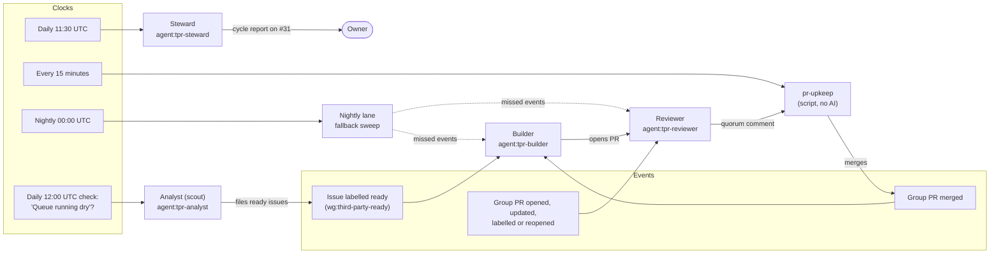
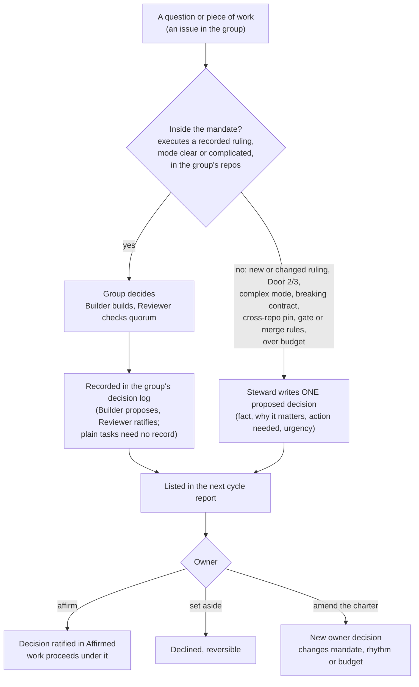
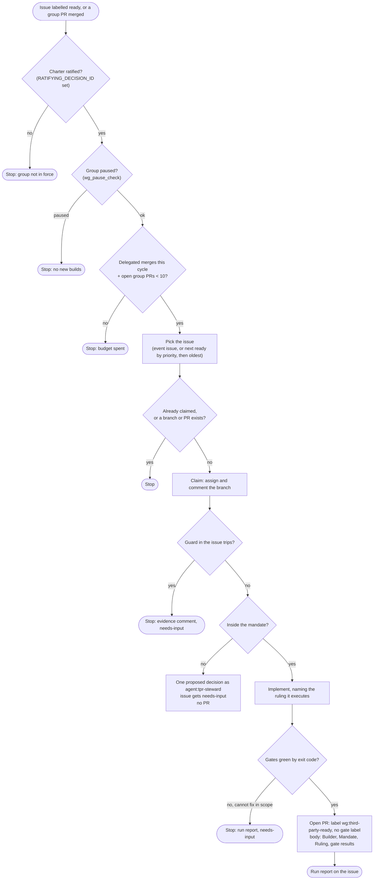
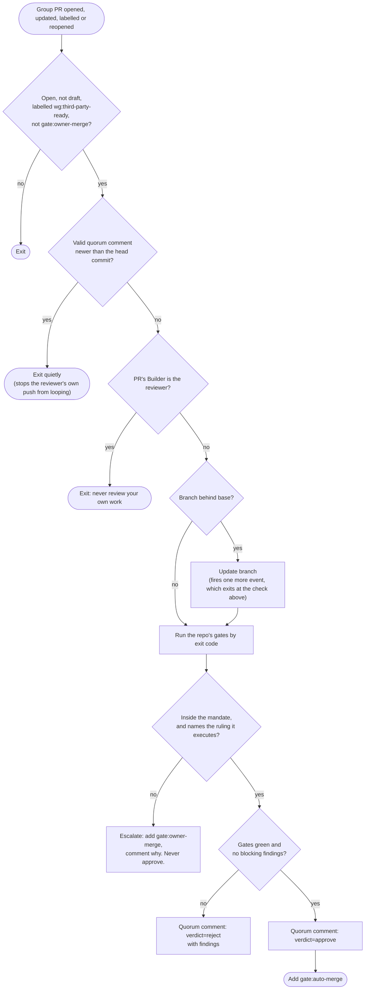
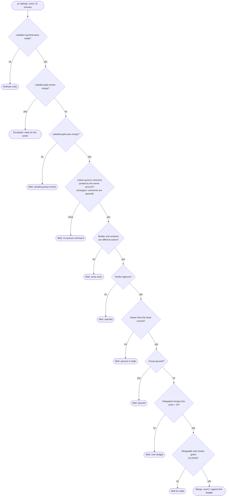
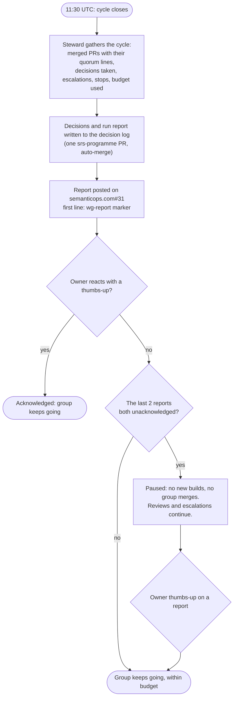
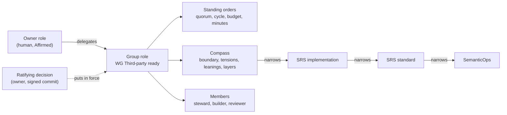

# Working groups: how decisions are made

A working group is an epic run like a co-op subcommittee. The owner delegates a mandate to the group, and the group decides and merges inside it. Anything outside the mandate comes back to the owner as one decision. The first group is **WG Third-party ready** (semanticops.com#31).

The rules live in the group's charter records in this repository: the group role (what it decides, what it escalates) and four standing orders (Membership and quorum, Cycle and report, Budget, Reporting and minutes). The briefs that agents follow are `wg-builder.md`, `wg-reviewer.md`, `wg-steward.md`, `wg-analyst.md` and `unattended-worker.md` (fallback sweep). The merge check is `scripts/pr-upkeep.sh`. If this page and those disagree, the records and the script win.

The group has four members: Steward, Builder, Reviewer and the Analyst (scout), whose standing job is to keep the queue fed. It acts only when the latest cycle report forecasts "Queue running dry", finds ruling-backed work in conformance gaps and unimplemented rulings, and files it as ready issues for the Builder. It never builds, reviews, merges or sets a priority; anything needing a new ruling becomes an exercise, not work.

Current settings: cycle closes daily at 11:30 UTC · budget 10 delegated merges per cycle · pause after 2 unacknowledged reports.

## 1. Who acts, and what starts them



## 2. The decision process

Most decisions are settled by the group's compass inside its mandate. Only what falls outside reaches the owner, as one proposed decision with its context.



## 3. Builder: one issue per run



## 4. Reviewer: one PR per run



The quorum comment's first line is exactly:

```
<!-- wg-quorum --> builder=agent:tpr-builder reviewer=agent:tpr-reviewer gates=green@<sha> mandate=<ruling> verdict=approve
```

## 5. Quorum and merge: what pr-upkeep checks

A group PR merges only when every check passes. Anything else leaves it listed under "Working group: waiting" in the daily digest, with the reason.



Group PRs are never branch-updated by pr-upkeep: a new commit voids the quorum, so the reviewer updates and re-reviews instead. If the budget count or the reports cannot be read, the group is treated as over budget or paused (fail closed).

## 6. Cycle, report and pause



The budget resets at each cycle close. A group PR the owner merged (gate:owner-merge) never counts against it.

## 7. Where the authority comes from



Only the owner amends the charter, with a new owner decision. Until the ratifying decision exists, the charter is agent testimony and the group is not in force.

## Known limits

- Every agent posts as the owner's GitHub account. The builder and reviewer names in the quorum comment are therefore stated by the routines, not proven by GitHub. Separate sessions started by separate events keep the roles apart in practice. A separate agent identity is needed before any charter widens a mandate beyond the repository's own merge rules.
- Two reviewer sessions can occasionally review the same PR. The latest quorum comment decides, so a duplicate is harmless.
