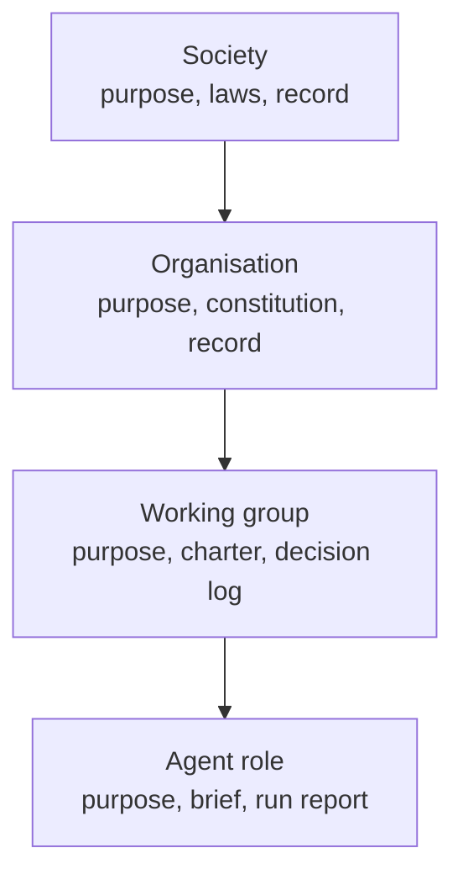
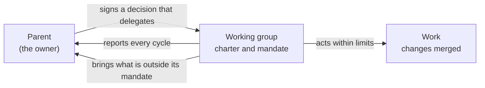
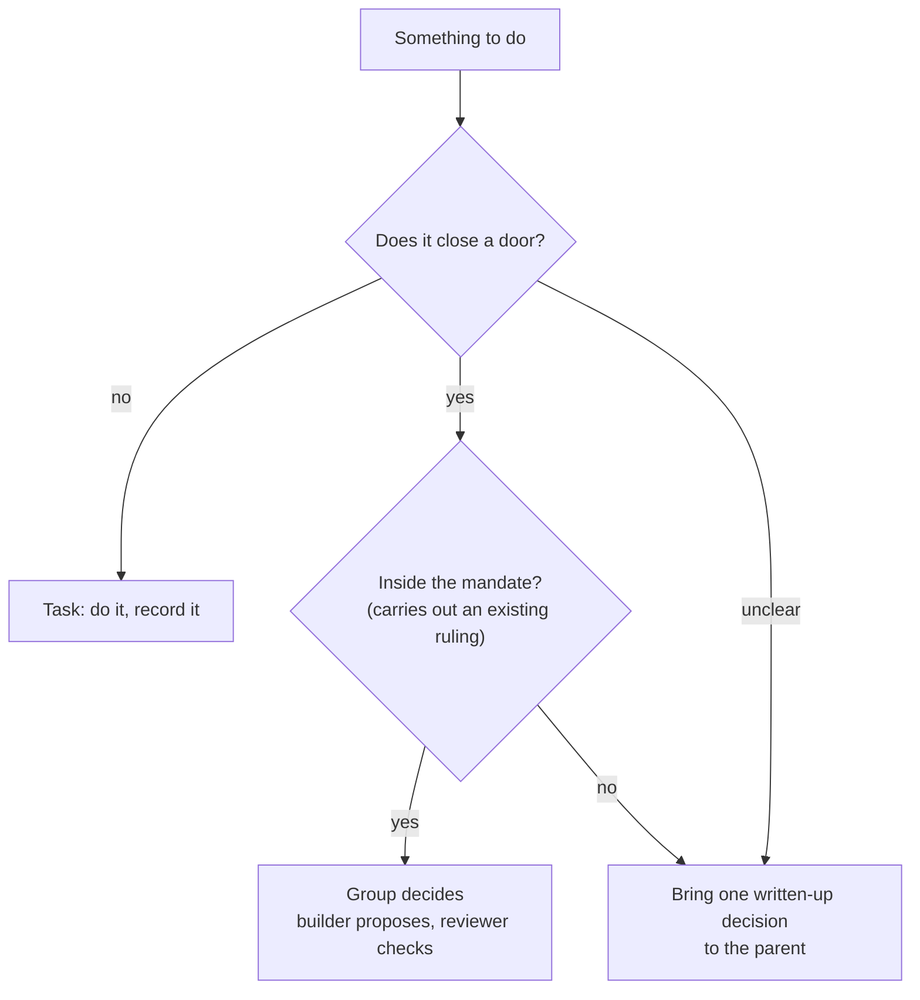
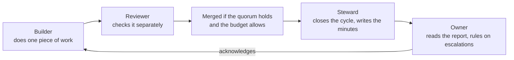
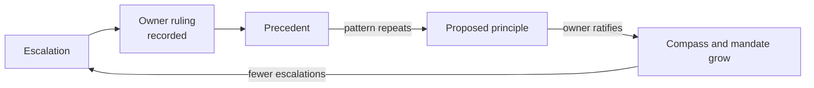

# Agents as a working democracy

*A living document. Practice amends it: every working group's cycle report ends with "What we learned", and lessons that recur come back here as proposed changes. First written 2026-10-10.*

## 1. The big idea

Our purpose is to help people live well in a complex world.

Part of that is learning to live alongside AI. Human and artificial minds are different. They notice different things, fail in different ways and carry different kinds of responsibility. Living well together means recognising those differences rather than pretending them away. It also means respecting the many connected parts of the world that any decision touches.

muDemocracy is a project to relearn democratic, open decision making and to build a cooperative culture from the ground up. Its starting point is simple: democracy is something we do, and it lives in the decisions we make and how we make them.

Underneath every system of governance is one problem: how to harness thinking at scale. A single mind can only hold so much. Governance is the frameworks and rails that let many minds think and act together, and stay aligned while they do. There are many models for this. Some make everyone think as one, and they are brittle: a single mind, however large, cannot see enough of a complex world to respond to it well. Our aim is different. We want a way of thinking together that fits into the natural world rather than overriding it; that can both invent new things and look after what already exists; and that stays responsive, with as much variety in how it sees and acts as the world it has to deal with. Many groups, each with its own purpose and its own way of leaning, held together by shared rules and honest records, can match a complex world in a way that one mind cannot.

Now some of the minds are artificial. Governance has to harness a mix of human and artificial thinking, and that is new.

Free societies work because power is **given**, **limited**, **written down** and **answerable**. Nobody simply takes it. It is handed over for a purpose, within limits, and the people who hold it report back to those who gave it.

This document applies that same pattern to AI agents. Agents doing our work are organised the way a good cooperative organises its people: in working groups with a clear purpose, written rules, limited authority and a duty to report. The pattern is the same at every scale, from a society to an organisation to a working group to a single agent's role.

*Same shape at every scale: each level has a purpose, rules it works under, and a record of what it did. Each level is given its authority by the one above, and reports back to it.*

## 2. Humans and agents are different

muDemocracy's foundation puts it plainly: "AI drafts, prompts, and surfaces; humans decide and ratify."

We keep that line. Agents are good at careful, tireless, rule-following work: reading a codebase, making a change, running every check, writing it up. People are needed for judgement: what matters, what to give up, what a rule should be, and when a rule no longer fits.

But "humans decide" can go wrong in two ways, and neither is real sovereignty:

- **Too much.** Dumping hundreds of decisions on a person is not giving them control; it is burying them. They end up approving what they cannot read.
- **The wrong kind.** Asking someone to choose between technical details when they cannot see the options or the consequences, and so cannot judge between them, is not giving them control either. It only moves the blame.

A person's role is to think deeply and to hold the full diversity of what is at stake. They will not know the specific details of work that an agent did. So a question reaches a person only when it is one they can actually judge, and it arrives with what they need to judge it: what is at stake in terms they care about (purpose, people, the tensions in play), the real options, what each would lead to, and a recommendation. A technical choice that comes down to "which way should this code be written" is settled by the group, under its compass. What comes up is the part that touches purpose or values, translated to that level.

The same holds in every direction. Each mind in the system, human or artificial, needs the information that fits how it thinks and what it is responsible for. Not more, not less, and in a form it can use. An agent needs exact rules and the precise state of the code. A person needs the meaning, the stakes and the choices. Getting this right is a large part of governance.

So the authority we give agents is the authority to **carry out** decisions people have already made. An agent working group may fix a bug the specification already rules on, or bring code in line with a recorded decision, and merge that work by itself. It may not make a new ruling. Anything that would close a door that people have not already closed comes back to a person, written up so they can decide quickly.

## 3. What a working group is

A working group is a small team of agents, each with one role, working towards one purpose inside clear limits. Its charter is a set of records that anyone can read:

- **Purpose:** what the group is for, and what it is not for.
- **Compass:** the tensions the group works within, at least three, and which way it leans on each ("this over that, unless..."). Most everyday choices are settled by the compass.
- **Mandate:** what the group may decide and merge by itself, and what it must bring to its parent.
- **Standing orders:** who must take part in a decision (the quorum), the group's rhythm, its budget, and how it keeps minutes.
- **Members:** a builder who does the work, a reviewer who checks it, and a steward who keeps the minutes and reports.
- **Decision log:** every decision the group takes, why, and under which rule.

As muDemocracy says: "The record is not bureaucracy; it is the group's standing to act." A group without its records has no authority at all.

### Members: stances, not job titles

A group's members are agents built on **archetypes**: basic stances a mind can take towards a situation. They come from a foundational synthesis. Understanding a whole system does not mean listing everything in it. It means finding a small number of basic tensions, broad enough to place everything inside the system's boundary, and then holding them in balance. Three such tensions describe how anyone can act:

- **Act or observe**: move now, or watch first.
- **Disrupt or stabilise**: change what is there, or make it hold.
- **Focus or zoom out**: go deep on one thing, or take in the whole.

Taking one side of each gives eight stances:

| Stance | What it brings | Call on it when | Its shadow |
|---|---|---|---|
| Initiator | Starts things moving | the work is stalled | overdrive |
| Challenger | Names what is broken | assumptions are out of date | cynicism |
| Builder | Makes things that last | things are unstable | rigidity |
| Synthesizer | Brings scattered parts together | things are scattered | over-design |
| Analyst | Finds the core issue | confusion reigns | paralysis by insight |
| Rebel | Questions why we do it at all | the work is stuck in a harmful pattern | destruction without direction |
| Steward | Protects what must endure | something needs holding or repair | resisting change |
| Watcher | Holds the long view | everyone is rushing | delay |

These are stances, not boxes. No stance is better than another, and each has a shadow when it is overused. A healthy group can call on the stance the moment needs, and no single stance dominates. That is a democratic principle too.

**The axes are relative to the boundary.** The same three tensions show up differently inside each boundary. In a codebase, "stabilise" might mean a migration that keeps old data working; in a writing group it might mean keeping a published argument consistent. Shift the boundary, and the same act can sit closer to the other pole. Each group therefore reads the stances through its own purpose and compass.

**Members are chosen by purpose.** A group brings in the members its purpose needs, most of them built on an archetype and tuned to the boundary. Composition is a choice to make on purpose:

- look for blind spots, meaning stances the group is missing;
- pair stances that complement each other;
- name the tensions between members openly, and bring their views together rather than silencing them.

The first group has a Builder (does the work), a Challenger as its reviewer (names what is broken), and a Steward (keeps the minutes and protects what endures). Its likely blind spot is the long view and the core issue, the Watcher and the Analyst. It will add them when its reports show it needs them.

Why many small groups rather than one big agent with every permission? For the same reason as in section 1. Each group sees its part of the world closely, leans its own way on its own tensions, and can be corrected on its own. Between them, groups keep enough variety to respond to a complex world. The shared pattern (purpose, rules, record, report) keeps them aligned without making them identical. Within each group, some work invents and some work maintains, and the compass says which way to lean when the two pull apart.

## 4. How authority is handed down

A group does not take authority; it is given it. The parent (today, the project owner) signs one decision that hands the mandate to the group. Three rules follow, borrowed from how human working groups are set up:

1. **The parent stays responsible.** Delegating a task is not giving away the duty.
2. **The limits are written down.** The mandate says which repositories, which kinds of change, and how much in one cycle.
3. **A standing rule changes only through a recorded decision.** Nobody quietly edits the rules, people and agents alike.

*How authority flows: down by a signed decision, back up by reports and escalations.*

## 5. Tasks and decisions

Not every act is a decision. The difference matters, because it decides who acts.

- A **task** doesn't close any doors. Do it, and record that it was done.
- A **decision** closes doors: it rules something in and something else out. Write it up (the question, the options, the choice, why, what it rules out, when to look again) and have it ratified by whoever holds that authority.
- **If it is unclear, treat it as a decision.**

*Task or decision? A group acts on its own only for tasks and for decisions inside its mandate.*

## 6. Rhythm and reports

Each group sets its own rhythm in its standing orders. A busy group might report every few hours, a quiet one weekly. The first group reports once a day, at lunchtime.

*One cycle. Two reports in a row with no acknowledgement pause the group, so delegated work never piles up unread.*

Each report is short and always has the same parts: the decisions waiting for the owner, each written at the owner's level as fact, why it matters, the real options and their consequences, a recommendation, and urgency. Technical detail stays one link away, never in the question itself. Then come what was decided within the mandate, what was done, what got stuck, the budget used, what comes next, and what we learned.

## 7. Theory and practice: how policy grows

We do not try to write every rule in advance. We write the essential charter, start the first group, and learn by doing.

At first many decisions will have unclear outcomes and will come to the owner. Each ruling is recorded. When rulings start to repeat a pattern, the steward proposes the pattern as a principle in the group's compass, or as a change to its standing orders. Once the owner ratifies it, the group can settle that kind of question itself next time. That is how the group gets faster without losing its footing: policy grows out of practice, and the practice is shaped by the policy.

*Rulings become precedents, precedents become principles, and the mandate grows with them.*

The same loop runs between this document and the groups. This document is the theory, and the groups' logs and reports are the practice. Each feeds the other.

## 8. Where this is heading

These are the next steps the theory names. Each is built when the practice reaches it, not before.

1. **One home for the rules.** Today some rules are repeated in scripts and briefs as well as in the charter. The goal: the charter records hold every rule, briefs are generated from them, and a check catches any rule that has drifted. *Built when a rule has to change by hand in more than one place.*
2. **The clerk.** In a human group the secretary keeps the procedure: counts the quorum, records the minutes, never decides the meaning. ("Wording is the secretary's; meaning is the group's.") We will build a small clerk program that does the same for agent groups. It will have its own identity, be the only thing that records governance acts, start the agents in turn, and enforce quorum, budget and pause from the charter. Rules that agents are only trusted to remember are not really enforced. *Built before any group is given more than the repository's own merge rules allow, or when a second group starts.*
3. **Fractal and shared.** muDemocracy's own agents already keep run reports and work under authority roles. They will run on the same pattern and the same clerk. A group may hand part of its work to a sub-group, but only by a recorded decision, and the same shape repeats at every scale.

## 9. Where we are now

The first group, **WG Third-party ready**, exists to make the reference implementation honour its rulings and its specification. It has a charter, a compass, a mandate and a decision log, and the owner ratified it on 2026-10-09. It reports daily on its epic (semanticops.com#31). The detailed operating flowcharts are in `routines/working-groups.md`.

What we know is not yet right:

- **Every agent acts under the owner's GitHub account.** The builder and the reviewer run as separate sessions, but GitHub cannot prove they are different. The clerk's own identity fixes this.
- **The builder and reviewer run once a night for now.** The event-driven version waits until the pace demands it.
- **Some rules live in more than one place.** "One home for the rules" fixes this.

We expect the first weeks to send many decisions back to the owner. That is the point: each one recorded makes the next one faster.
